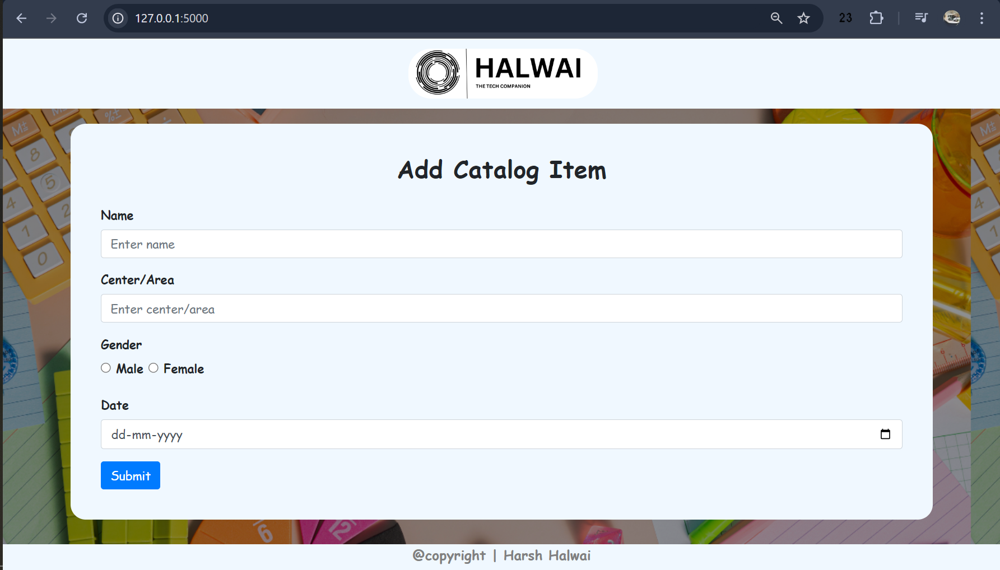
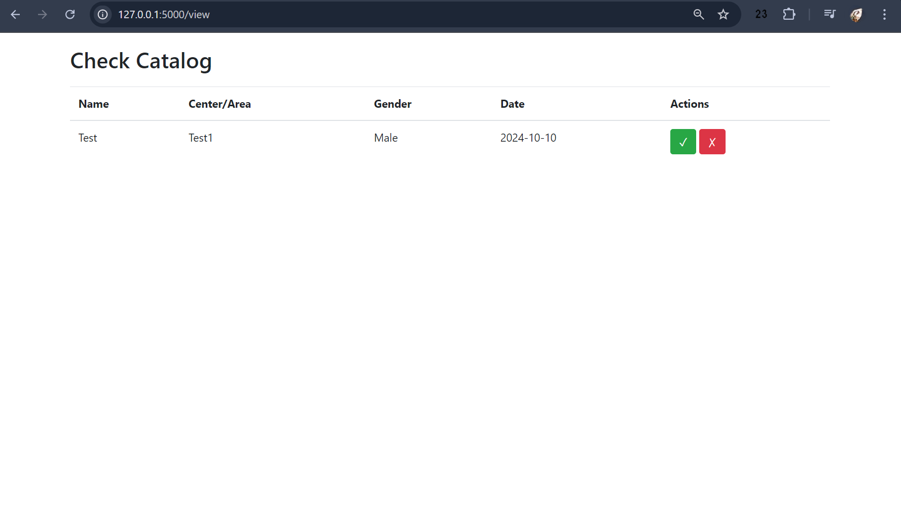

# Custom-Catalog-form
This Project is developed in Python, basic HTML & CSS
Copyrights reserved by Harsh Halwai

## 

## This is basic form designing and validation using HTML, CSS & JS
### Follow the steps to execute it:
- Copy the files as it is, shown in the repository to your local system
- open any editor choice, For VS code users open the APP.PY file.
- Run the APP.PY file using the Python command or directly with the Run Button.
- Open the browser and go to the URL https://localhost:5000 (if not, you can find the path in the terminal) 
- After Submitting the form your data catalog has been saved to catalog. DB
- To access the catalog list, you can go to the URL https://localhost:5000/view you will have the list of all the catalog forms.
- you can delete the catalog by clicking on the Cross emoji.

