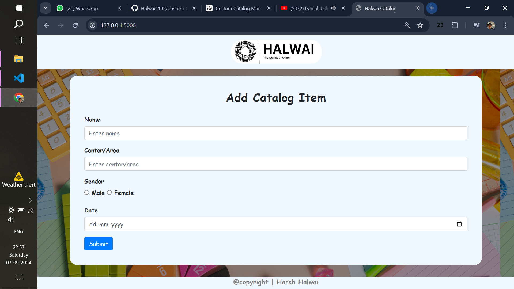

# Custom-Catalog-form
This Project is developed in Python programming language.

## This is basic form designing and validation using HTML,CSS & Js
### Follow the steps to execute it:
- Copy the files as it as stored in the repository 
- open any choice of editor, For VS code user open the APP.PY file.
- Run the APP.PY file using python command or directly with Run Button.
- Open the browser and go to the url https://localhost:5000 (if not, you can find the path in the terminal) 
- After Submitting the form your data catalog has been saved to catalog.db
- To access the catalog list, you can go to url https://localhost:5000/view you will have the list of all the catalog forms.